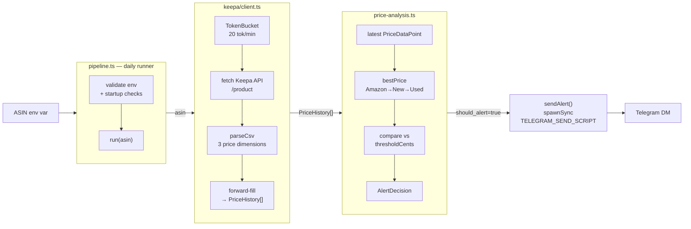

# price-pulse

[](https://github.com/damilola-elegbede-org/price-pulse/actions/workflows/ci.yml)


Amazon price tracker that ingests Keepa API history for a curated set of coffee ASINs, evaluates current price against configured thresholds, and fires Telegram alerts on drops.

## Architecture

> **Target architecture (ENG-377/ENG-330).** The analysis → alert path is not yet wired. The current pipeline fetches price history from Keepa and logs the count; `analyzePrice` and the non-error alert dispatch are added in ENG-377 and ENG-330.



## Tech stack

| Layer | Choice |
|---|---|
| Runtime | Node.js 22 |
| Language | TypeScript 5 (strict mode) |
| Price data | Keepa API |
| Alerting | Telegram (shell script interface) |
| Tests | Jest + ts-jest |
| CI | GitHub Actions (typecheck + test) |

## Key design decisions

**Token-bucket rate limiting.** Keepa's €49/mo plan allows 20 requests/minute. `TokenBucket` in `src/keepa/client.ts` sleeps until capacity is available rather than throwing, so multi-ASIN pipelines are self-throttling with no manual delays. The bucket is module-level so all callers share one instance.

**Keepa CSV parsing.** Keepa returns price history as interleaved `[keepaTime, priceCents, ...]` arrays with a custom epoch (2011-01-01 UTC, minute precision) and three separate price dimensions (Amazon direct / new third-party / used). The parser merges all timestamps into a single sorted series and forward-fills each dimension, so every returned `PriceHistory` row carries all three last-known values. Keepa's `≤ 0` sentinel for "out of stock" is normalised to `null`.

**Structural interface compatibility.** `PriceDataPoint` (the input type of `analyzePrice`) is a structural subset of `PriceHistory` (output of `getProductHistory`), so the array is directly assignable without casting. This keeps the two modules independently testable while remaining composable.

**Telegram via shell script.** `pipeline.ts` shells out to `TELEGRAM_SEND_SCRIPT` rather than wiring a Telegram SDK. This decouples the pipeline from bot credentials and reuses the shared `telegram-send.sh` already in the fleet. Messages are capped at 120 characters; full error detail goes to stderr only.

## Setup

```bash
node --version   # requires >=22
npm install
```

Create a `.env` file (not committed) with the required environment variables:

```ini
KEEPA_API_KEY=your_key_here
ASIN=B001E4KFG0
TELEGRAM_SEND_SCRIPT=/path/to/telegram-send.sh
```

## Running the pipeline

```bash
npm run build
ASIN=B001E4KFG0 TELEGRAM_SEND_SCRIPT=/path/to/send.sh node dist/pipeline.js
```

### Automated execution (launchd)

The plist `launchd/bareclaude.price-pulse.daily-alert.plist` fires the pipeline daily at **09:00 Mountain Time** via `scripts/price-alert-run.sh`.

| Detail | Value |
|---|---|
| launchd label | `bareclaude.price-pulse.daily-alert` |
| Fire time | 09:00 MT (local system clock) |
| Credential source | `finn/.credentials/keepa-api.age` — decrypted at runtime; no `.env` needed in cron mode |
| Prerequisite | `npm run build` must have been run and `dist/pipeline.js` must exist (see ENG-254) |

**Install steps:**

```bash
# 1. Build the pipeline first
npm run build

# 2. Symlink the plist into ~/Library/LaunchAgents
ln -sf "$(pwd)/launchd/bareclaude.price-pulse.daily-alert.plist" \
  ~/Library/LaunchAgents/bareclaude.price-pulse.daily-alert.plist

# 3. Bootstrap
launchctl bootstrap gui/$(id -u) \
  ~/Library/LaunchAgents/bareclaude.price-pulse.daily-alert.plist
```

Logs land in `finn/.state/price-alert-run.log`.

**Exit codes**

| Code | Meaning |
|---|---|
| `0` | Success — price fetched, threshold evaluated |
| `1` | Keepa fetch failure, missing env var, or unhandled error |

**Expected output on success**

```
Fetched 4821 price points for ASIN B001E4KFG0
```

## Configuration

| Variable | Required | Purpose |
|---|---|---|
| `KEEPA_API_KEY` | Yes | Keepa API key |
| `ASIN` | Yes (CLI) | Amazon ASIN to track |
| `TELEGRAM_SEND_SCRIPT` | Yes (CLI) | Path to an executable that accepts `--raw <message>` for alert delivery |
| `DB_PATH` | No (reserved) | SQLite database path — injected by the launchd plist, not yet read by the pipeline. Will be consumed when ENG-254 (storage + backfill) lands. |

`TELEGRAM_SEND_SCRIPT` is validated as executable at startup. The pipeline exits 1 if it is unset or not executable.

## Development

```bash
npm install
npm run typecheck   # type-check without emitting (fast feedback)
npm test            # Jest suite via ts-jest
npm run build       # compile TypeScript to dist/
```

Tests live alongside source in `src/`. Each module ships its own `.test.ts`:

| Test file | What it covers |
|---|---|
| `src/keepa/client.test.ts` | TokenBucket timing + capacity, CSV parsing edge cases, fetch error paths, Keepa epoch conversion |
| `src/price-analysis.test.ts` | Best-price selection, threshold logic, empty history, Keepa -1 sentinel, `drop_pct` sign |
| `src/pipeline.test.ts` | Fetch failure → Telegram alert, message truncation, spawn failure handling |

## Project status

| Issue | Work | Status |
|---|---|---|
| ENG-295 | Repo scaffold | ✅ Done |
| ENG-265 | Keepa API client + token-bucket rate limiting | 🔄 In review |
| ENG-377 | Price-comparison and alert-decision engine | 🔄 In review |
| ENG-462 | Keepa fetch-failure alerting in daily pipeline | 🔄 In review |
| ENG-254 | MVP sprint (storage, backfill, multi-ASIN) | 📋 Planned |
| ENG-571 | Daily launchd cron + wrapper script (`scripts/price-alert-run.sh`) | 🔄 In review |

See [docs/architecture.md](docs/architecture.md) for a component-level deep dive.

## License

MIT
