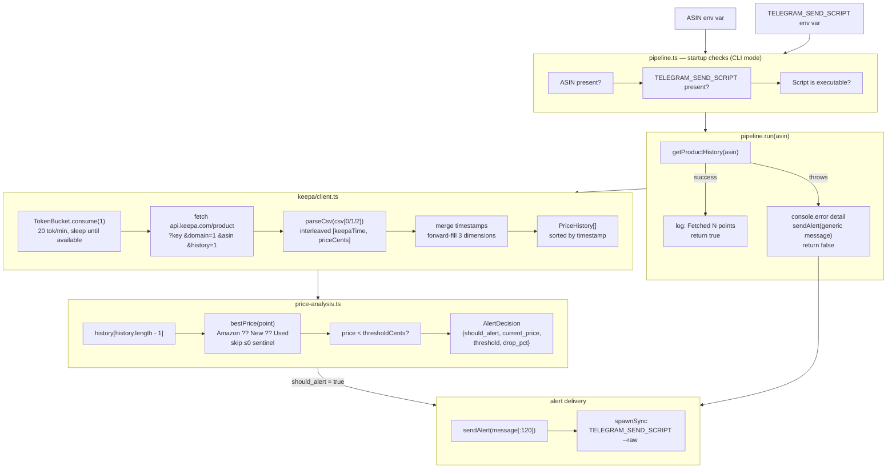

# Architecture

## Data flow



## Component reference

### `keepa/client.ts`

**`TokenBucket`** — leaky-bucket rate limiter.

Keepa's €49/mo plan allows 20 tokens/minute with a burst capacity of 20. `consume(n)` calls `refill()` (which computes tokens earned since last call using wall-clock delta × rate), then either deducts `n` immediately or sleeps `ceil((deficit / refillRate))` ms before proceeding. A module-level singleton is used by all `getProductHistory` calls so concurrent invocations share one bucket.

Configuration at module level:
```typescript
const _bucket = new TokenBucket(/* capacity */ 20, /* tokensPerMinute */ 20);
```

**`getProductHistory(asin)`** — fetches and parses a product's price history.

Keepa's CSV format quirks handled here:
- Custom epoch: `2011-01-01T00:00:00 UTC`, timestamps in minutes → `new Date(epoch + t * 60_000)`
- Three CSV columns: `csv[0]` = Amazon direct, `csv[1]` = new third-party, `csv[2]` = used
- Each column is interleaved: `[t0, p0, t1, p1, ...]` — pairs at stride 2
- `price ≤ 0` → `null` (Keepa's "out of stock" or "not tracked" sentinel)
- Timestamps from all three series are unioned and sorted; the last-seen value for each dimension is forward-filled to every timestamp in the merged series

Return type: `PriceHistory[]` sorted ascending by `timestamp`.

---

### `price-analysis.ts`

**`analyzePrice(history, thresholdCents)`** — determines whether to alert.

Reads the last element of `history` (the most recent data point), extracts the best available price (`priceAmazon ?? priceNew ?? priceUsed`, skipping the Keepa `-1` sentinel), and compares against `thresholdCents`.

Sentinel handling:
- Empty `history` → `{ should_alert: false, current_price: -1, drop_pct: 0 }`
- Latest point has no usable price → same no-alert sentinel
- `thresholdCents ≤ 0` → safe no-op (avoids divide-by-zero in `drop_pct`)

`drop_pct` is `(threshold - current) / threshold * 100`: **positive** means the price is below the threshold (a genuine drop); **negative** means above. Callers can use the sign to display "X% off" vs "X% over target".

**Integration contract (for ENG-330, Telegram dispatcher):**
All monetary values — `PriceHistory.price*`, `thresholdCents`, `AlertDecision.current_price`, `AlertDecision.threshold` — are **USD cents** throughout the pipeline. Divide by 100 only at display time.

---

### `pipeline.ts`

**`run(asin)`** — top-level orchestrator.

1. Calls `getProductHistory(asin)` (which handles rate limiting internally).
2. On success: logs `Fetched N price points for ASIN <asin>`, returns `true`.
3. On `getProductHistory` error: logs detail to stderr, calls `sendAlert` with a generic message (error detail is intentionally not included in the Telegram message to avoid leaking internal state), returns `false`.

Price analysis (`analyzePrice`) and the non-error alert path are wired in ENG-377 and ENG-330.

**`sendAlert(message)`** — shells out to `TELEGRAM_SEND_SCRIPT --raw <message[:120]>`.

Message is truncated to 120 characters before dispatch. Uses `spawnSync` with `stdio: 'inherit'` so the script's output/errors appear in the pipeline's stderr. Logs a warning but does not throw if the script exits non-zero or `TELEGRAM_SEND_SCRIPT` is unset.

**CLI entrypoint** (`require.main === module`):
- Validates `ASIN` env var (required, exits 1 if missing)
- Validates `TELEGRAM_SEND_SCRIPT` env var (required, exits 1 if missing)
- Validates the script is executable via `accessSync(script, constants.X_OK)` (exits 1 if not)
- Calls `run(asin)` and exits 1 on failure

## Testing approach

Each module is tested in isolation. External dependencies are mocked at the module boundary:

- `keepa/client.test.ts` — `global.fetch` is replaced with `jest.fn()` per test. Token bucket timing uses `jest.useFakeTimers()` with `advanceTimersByTimeAsync` to avoid real sleeps.
- `price-analysis.test.ts` — pure function; no mocks needed.
- `pipeline.test.ts` — `child_process.spawnSync` and `./keepa/client.getProductHistory` are mocked via `jest.mock()`.

## Storage layer

### Shipped in ENG-570

`db/migrations/001_init.sql` and `src/db.ts` landed the SQLite persistence layer:

- **Schema:** three tables — `price_history`, `alert_config`, `alert_log` — with `UNIQUE` constraints on `(asin, timestamp)` and `(asin, alert_ts)` for idempotent retries.
- **Module:** `src/db.ts` exports `openDb`, `insertPriceHistory`, `getPriceHistory`, `upsertAlertConfig`, `getAlertConfig`, `insertAlertLog`, `getRecentAlerts`. See the `src/db.ts` component reference below.

### Planned in ENG-254

Pipeline integration — wiring `insertPriceHistory` calls into `pipeline.run()` so every Keepa fetch is persisted, enabling:
- Multi-ASIN tracking in a single daily run
- Historical trend analysis across pipeline runs
- Smarter threshold auto-adjustment based on 30/90-day price distributions

---

### `src/db.ts`

**`openDb(filePath)`** — opens (or creates) a SQLite database and applies the initial schema migration.

- `filePath` is either `':memory:'` (tests) or an absolute path to the database file. The conventional production path is driven by an env var (`DB_PATH`) set by the caller — not hardcoded in this module. The ENG-254 pipeline integration will document the default.
- File-based databases are hardened to `0o600` (owner read/write only) immediately after creation.
- Enables WAL journal mode and FK enforcement on every connection.
- Migration is idempotent (`CREATE TABLE IF NOT EXISTS`) — safe to call on an existing database.

**Exported CRUD functions** — all monetary values (`price`, `threshold`, `priceAtAlert`) are **USD cents**. `timestamp` / `alert_ts` are **Unix epoch seconds (UTC)**.

| Function | Description |
|---|---|
| `insertPriceHistory(db, asin, timestamp, price, currency?)` | Writes a price point; silently no-ops on duplicate `(asin, timestamp)` |
| `getPriceHistory(db, asin, sinceTs?)` | Returns rows for an ASIN, ascending by timestamp. `sinceTs` bounds the query — pass a 30/90-day epoch to avoid loading full history |
| `upsertAlertConfig(db, asin, threshold, enabled?)` | Creates or updates the alert config for an ASIN |
| `getAlertConfig(db, asin)` | Returns the config row, or `undefined` if the ASIN is not configured |
| `insertAlertLog(db, asin, alertTs, priceAtAlert)` | Logs a fired alert; silently no-ops on duplicate `(asin, alert_ts)` |
| `getRecentAlerts(db, asin, sinceTs)` | Returns alert log rows at or after `sinceTs`, descending — use for dedup before re-firing |

**FK constraint:** `alert_log.asin` references `alert_config.asin`. Insert into `alert_log` requires a matching `alert_config` row.
